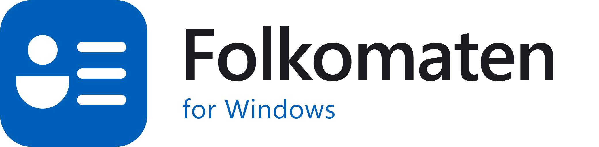
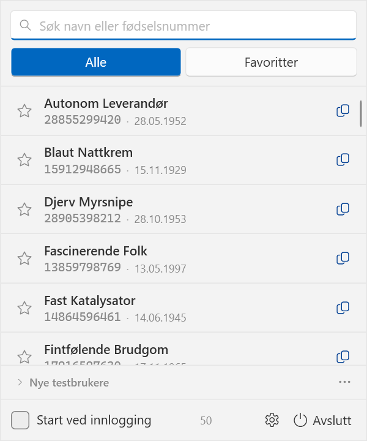

<h1 align="center">
  <picture>
    <source media="(prefers-color-scheme: dark)" srcset="docs/logo-dark.png">
    
  </picture>
</h1>

<p align="center">
  <a href="https://github.com/janode/folkomaten-windows/releases"></a>
  <a href="https://github.com/janode/folkomaten-windows/actions/workflows/ci.yml"></a>
  <a href="https://github.com/janode/folkomaten-windows"></a>
  <a href="https://www.microsoft.com/windows"></a>
  <a href="https://dotnet.microsoft.com/"></a>
  <a href="LICENSE"></a>
</p>

En liten app i systemstatusfeltet som lar deg kopiere fødselsnummeret til en BankID-testbruker med ett klikk. De samme brukerne finnes i Det Sentrale Folkeregisterets (DSF) testdatabase, så de virker både mot BankID preprod og mot testmiljøer som slår opp i folkeregisteret.

Dette er en Windows-utgave av [Folkomaten](https://github.com/olefredrik/Folkomaten) for macOS, laget av Ole Fredrik Lie. Funksjonene er de samme; koden er skrevet på nytt i C# og WPF.



## Funksjoner

- **Innebygde brukere**: 50 syntetiske eksempelbrukere følger med, så appen virker med en gang.
- **Kopier**: klikk på en rad, så ligger fødselsnummeret på utklippstavla.
- **Global hurtigtast**: `Ctrl+Alt+F` åpner appen uansett hvilket program du er i. Den kan endres i innstillingene.
- **Søk og favoritter**: søk på navn eller fødselsnummer, og merk brukerne du bruker ofte.
- **Fødselsdato**: utledes fra fødselsnummeret.
- **Egne filer**: last inn egne testbrukere. Sist brukte fil huskes til neste oppstart.
- **Hent fra Tenor**: hent nye testpersoner fra Skatteetatens testdatasøk (se [Hente egne testbrukere](#hente-egne-testbrukere)).
- **Start ved innlogging**: la appen starte når du logger inn.
- **Tøm liste**: start tomt. Valget huskes, og du henter de innebygde tilbake med *Last inn eksempelbrukere*.

## Installasjon

Krever Windows 10 eller 11 (x64).

Last ned `Folkomaten-win-x64.exe` fra [siste release](https://github.com/janode/folkomaten-windows/releases/latest), legg den et fast sted og start den. Har du [.NET 10 Desktop Runtime](https://dotnet.microsoft.com/download/dotnet/10.0) installert, kan du ta den lille `Folkomaten-win-x64-lite.exe` i stedet.

Fila er ikke signert, så Windows SmartScreen spør første gang: velg *Mer informasjon* og *Kjør likevel*.

Appen har ikke noe vindu på oppgavelinja. Trykk `Ctrl+Alt+F`, eller klikk ikonet i systemstatusfeltet. Windows gjemmer ofte nye ikoner bak pila (`^`); dra ikonet ut på oppgavelinja om du vil ha det synlig. Starter du exe-fila en gang til, åpnes appen som allerede kjører.

## Innlogging i BankID preprod

Alle testbrukerne deler samme innlogging:

- **Engangskode (OTP)**: `otp`
- **Passord**: `qwer1234`

Se [BankIDs dokumentasjon](https://developer.bankid.no/) for tilgang til preprod-appen.

## Hente egne testbrukere

Brukerne hentes fra Tenor, så de finnes i folkeregisteret i test. Deretter bestiller du dem i BankID preprod før de virker mot BankID. Åpne *Nye testbrukere* nederst i appen:

1. **Hent fra Tenor**: velg antall. Appen henter brukerne og lagrer dem som fil. Krever [oppsett](#oppsett-tilgang-til-tenor).
2. **Koble til BankID**: åpner bulk-order-siden i BankID preprod. Last opp fila, trykk *Order* og vent til bestillingen er fullført.
3. **Last inn i appen**: velg fila.

Appen henter bare ordinære fødselsnummer (ikke D-nummer) for myndige og bosatte personer, slik at alle kan bestilles. Den henter dobbelt så mange som du ber om og kutter ned etter filtrering.

### Oppsett: tilgang til Tenor

Appen autentiserer seg mot Skatteetatens søke-API via Maskinporten (testmiljøet). Dette gjøres én gang per maskin.

1. **Be om tilgang**: send e-post til Tenor@skatteetaten.no med organisasjonsnummer, og be om scopet `skatteetaten:testnorge/testdata.read`.
2. **Opprett en Maskinporten-klient** i [selvbetjeningen for test](https://sjolvbetjening.test.samarbeid.digdir.no/): legg til scopet, legg til en generert nøkkel, last ned privatnøkkelen (PEM), og noter *Klient ID* og nøkkelens *kid*.
3. **Legg inn i appen**: åpne innstillingene (tannhjulet), fyll inn *Klient ID*, *Nøkkel-ID (kid)* og *Privat nøkkel (PEM)*, og klikk *Lagre*.

Legitimasjonen lagres kryptert med Windows DPAPI i `%APPDATA%\Folkomaten\credentials.bin`. Bare din Windows-bruker på denne maskinen kan lese den, og den forlater aldri maskinen.

## Filformat

Én testbruker per linje, kommaseparert:

```
fødselsnummer,fullt navn,etternavn,fornavn
04869248709,Frode Aas,Aas,Frode
```

Appen leser UTF-16 (slik BankID preprod lager filene) og UTF-8. Fødselsnumrene er syntetiske og tilhører ingen virkelige personer.

## Hvordan fødselsdato utledes

Fra et fødselsnummer `DDMMÅÅiiikk`:

- **Dag**: D-nummer legger 40 til dagen.
- **Måned**: syntetiske numre legger 80 til måneden, H-nummer legger 40.
- **Århundre**: følger individnummeret (`iii`) etter Skatteetatens regler. Tvetydige syntetiske numre antas å være fra 1900-tallet.

## Utvikling

Krever [.NET 10 SDK](https://dotnet.microsoft.com/download/dotnet/10.0).

```powershell
dotnet build Folkomaten.slnx -warnaserror
dotnet run --project src/Folkomaten
dotnet test --project tests/Folkomaten.Tests/Folkomaten.Tests.csproj
```

| Mappe | Innhold |
| --- | --- |
| `src/Folkomaten.Core` | Logikk uten UI: testbrukere, fødselsdato, filformat, innstillinger, Maskinporten og Tenor |
| `src/Folkomaten` | WPF-appen: ikon i systemstatusfeltet, hurtigtast, panel og innstillinger |
| `tests/Folkomaten.Tests` | xUnit-tester |

Innstillinger (favoritter, sist brukte fil, hurtigtast) ligger i `%APPDATA%\Folkomaten\settings.json`.

En ny versjon lages ved å tagge: `git tag v1.2.3 && git push origin v1.2.3`. GitHub Actions bygger exe-filene og legger dem på en release.

## Lisens

MIT, se [LICENSE](LICENSE). Basert på [Folkomaten](https://github.com/olefredrik/Folkomaten) av Ole Fredrik Lie (MIT).

«BankID» er et varemerke og brukes her kun beskrivende. Dette er et uavhengig verktøy uten tilknytning til BankID.
